<center>

[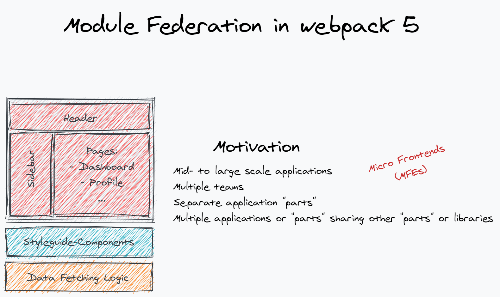](ModuleFederationWebpack5/1.png)

</center>

The motivation for Module Federation is developing one or more applications with multiple teams.

Applications are split into smaller application "parts". These could be frontend components like a "Header" or "Sidebar" component, but also logical components like "Data Fetching Logic" or other business logic.

Each part can be developed by a separate team.

Applications or parts of them share other parts or libraries.

<hr>

<center>

[](https://live.jsnation.com/)

</center>

<hr>
<center>

[](ModuleFederationWebpack5/2.png)

</center>

Let's look at the existing options you have when using webpack...

<hr>
<center>

[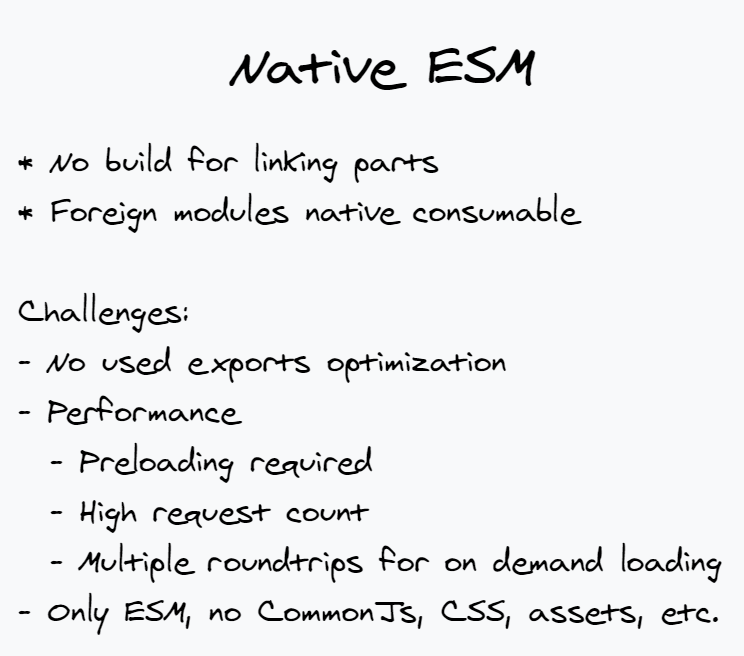](ModuleFederationWebpack5/3.png)

</center>

<hr>
<center>

[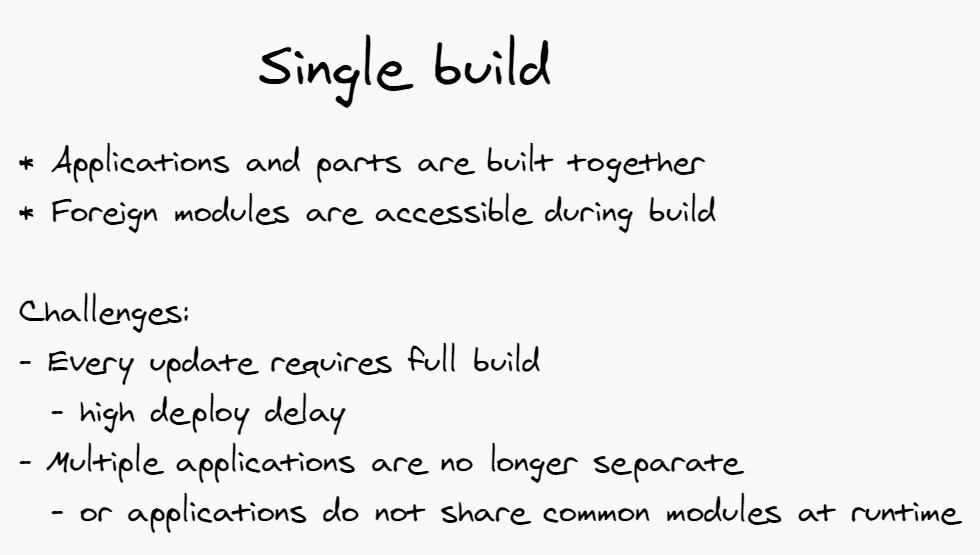](ModuleFederationWebpack5/4.png)

</center>

<hr>
<center>

[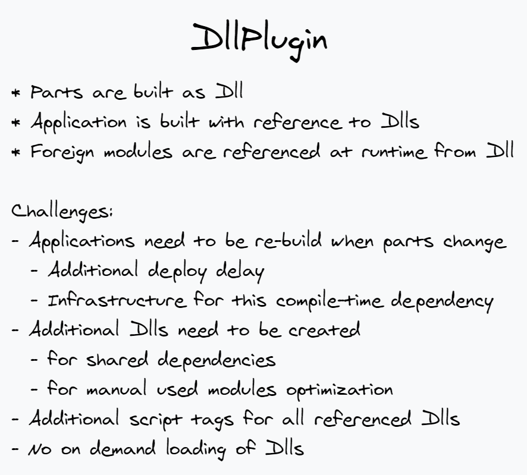](ModuleFederationWebpack5/5.png)

</center>

<hr>
<center>

[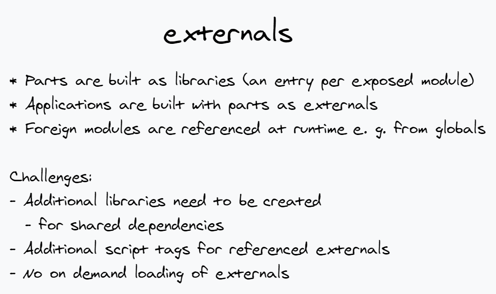](ModuleFederationWebpack5/6.png)

</center>

<hr>
<center>

[](ModuleFederationWebpack5/7.png)

</center>

<hr>
<center>

[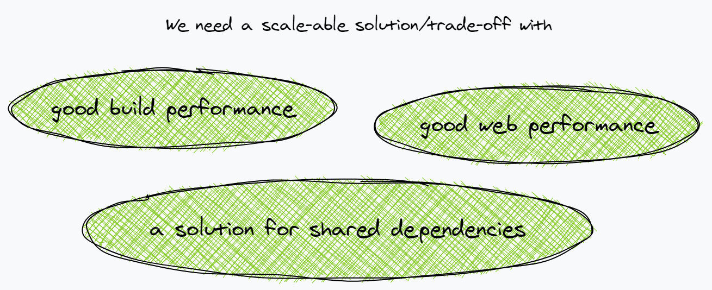](ModuleFederationWebpack5/8.png)

</center>

which brings us to...

<center>

[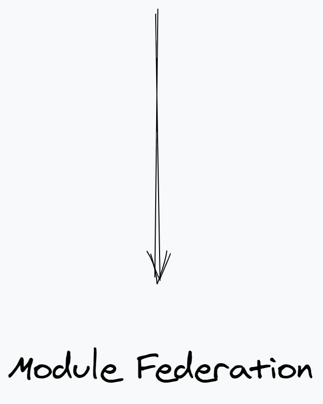](ModuleFederationWebpack5/9.png)

</center>

<hr>
<center>

[](ModuleFederationWebpack5/10.png)

</center>

With Module Federation each part would be a separate build. These builds are compiled as "Containers".

Containers can be referenced by applications or other containers.

In such a relationship the container is the "remote" and the consumer of the container is the "host". The "remote" can expose modules to the "host". The "host" can use such modules. They are called "remote modules".

By using separate builds we getting a good build performance for the whole system.

<hr>
<center>

[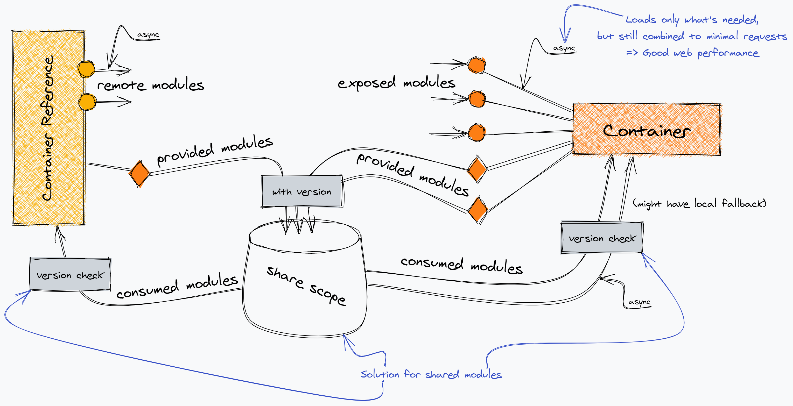](ModuleFederationWebpack5/11.png)

</center>

This is an overview of Module Federation.

The two aspects of Module Federation are shown here: exposed modules and shared modules.

The container exposes modules in an async way. You would ask the container to load/download the modules you want to use before using them from the container. Async exposing allows the build to put each exposed module in a separate file, together with its dependencies. This way only used modules have to be loaded, but the container can still bundle modules together. Additionally, usually, chunking techniques from webpack apply here (like vendor splitting or creating a file for common dependencies between exposed modules). This allows us to keep requests and total download low, which leads to good web performance.

The consumer of the container needs to be able to handle async loading of exposed modules. Here webpack will do some trickery, which we will see later.

The other aspect, shared modules, is also shown here. Every party, containers, and applications, can put shared modules into the share scope together with version information. And they are also able to consume shared modules from the share scope together with a version requirement check. The share scope will deduplication shared modules in a way that provides each party with the highest available version of a shared module that within the version requirement.

Shared modules are also provided and consumed in an async way. So providing shared modules has no download cost. Only used/consumed shared modules are downloaded.

<hr>
<center>

[](ModuleFederationWebpack5/12.png)

</center>

Let's take a look at an example...

<hr>
<center>

[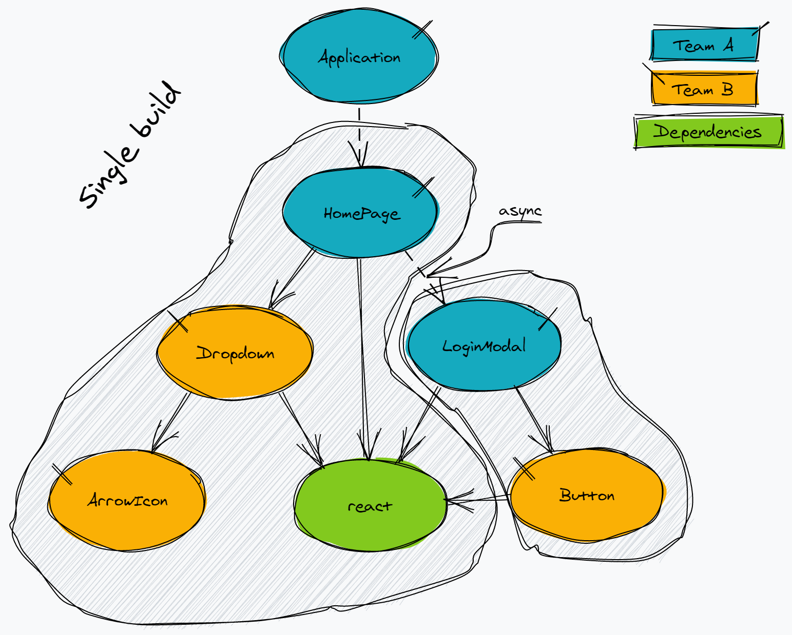](ModuleFederationWebpack5/13.png)

</center>

Here a single build application is shown.

A "HomePage" (from team A) uses a "Dropdown" component (from team B). A "Login" link on the "HomePage" loads the "LoginModal" (from team A) on-demand, which uses a "Button" component (from team B).

"react" is used by nearly all modules from both teams.

Let's apply Module Federation to this application...

<hr>
<center>

[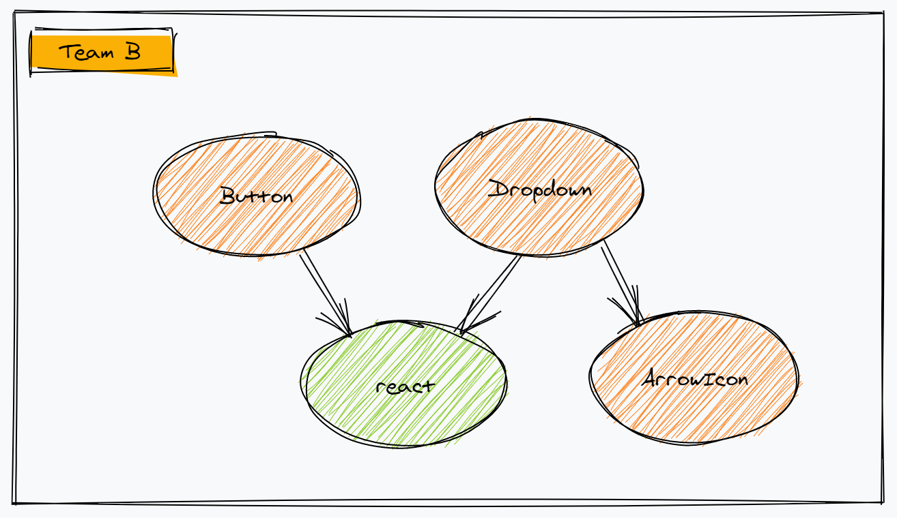](ModuleFederationWebpack5/14.png)

</center>

From team Bs point of view. Team B only cares about its components.

<hr>
<center>

[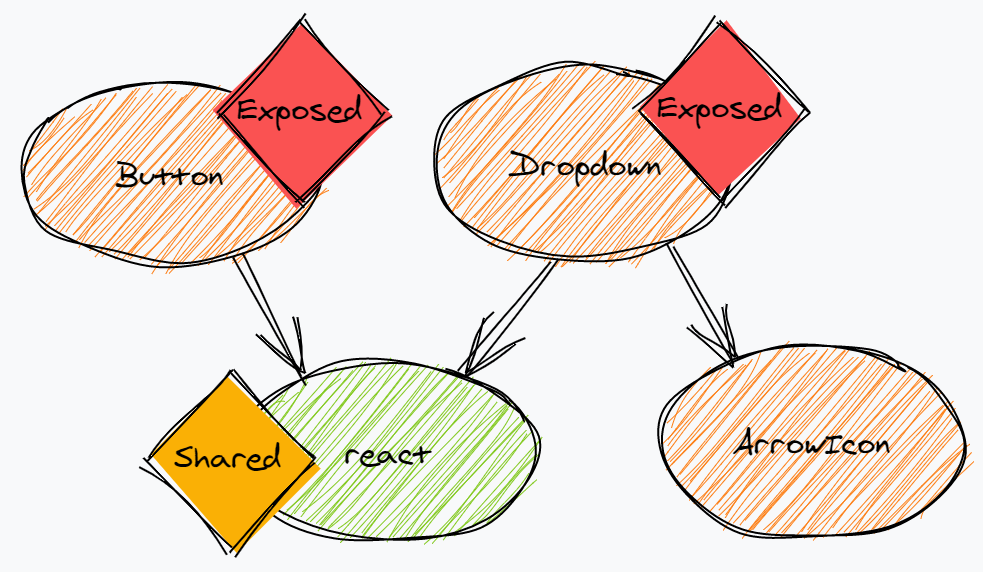](ModuleFederationWebpack5/15.png)

</center>

Team B wants to build a "Container" and therefore flags some of their modules. "Button" and "Dropdown" are flagged as "Exposed" as they should be usable by other teams.

"react" is flagged as "Shared", so that it can potentially be shared with other teams.

<hr>
<center>

[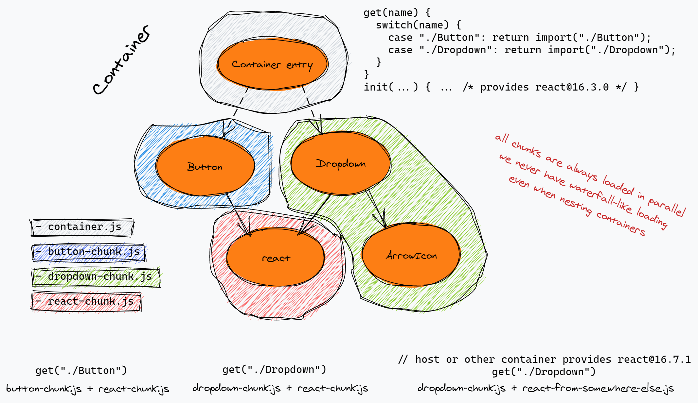](ModuleFederationWebpack5/16.png)

</center>

Now, webpack kicks in...

webpack will automatically generate a "Container entry" for the container. This generated module will contain references to all exposes and shared modules and how to load them.

Each exposed module is put into a separate file together with dependencies.

Each shared module is also put into a separate file.

When loading "Button" from the container it would only load the button chunk and the react chunk. When loading "Dropdown" it would only load the dropdown chunk and the react chunk.

When loading "Dropdown", but another party has provided another react version (potentially higher) it would load the dropdown chunk and the chunk for the provided react version of the other party (Actually it delegates the loading operation to the other party and they will load the chunk, if it hasn't already been loaded yet).

<hr>
<center>

[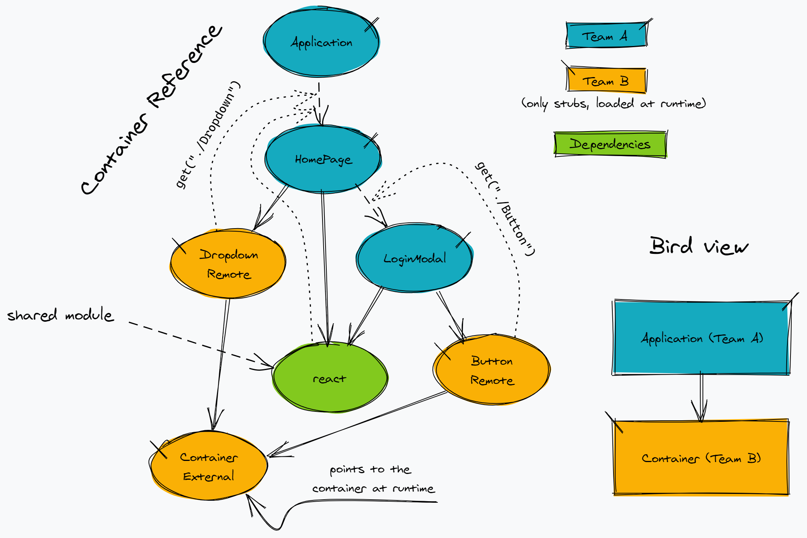](ModuleFederationWebpack5/17.png)

</center>

Here is how team A would consume the container of team B.

Module from team B is not included directly. Instead, only "Remote module" stubs are used. They reference the container at runtime and will load the module from the container instead (at runtime).

The tricky part is the async loading. A normal `import` is sync and can't wait until the module is downloaded. Some webpack magic will hoist all async remote module loading up to the next async boundary (like an `import()`). At this point, remote modules will be loaded by the container in parallel to the download of the normal modules in this chunk.

An example is the "Login" link, which opens the "LoginModal". When clicking on the link the code for "LoginModal" and the code for "Button" will download in parallel.

A similar thing happens for shared modules.

<hr>
<center>

[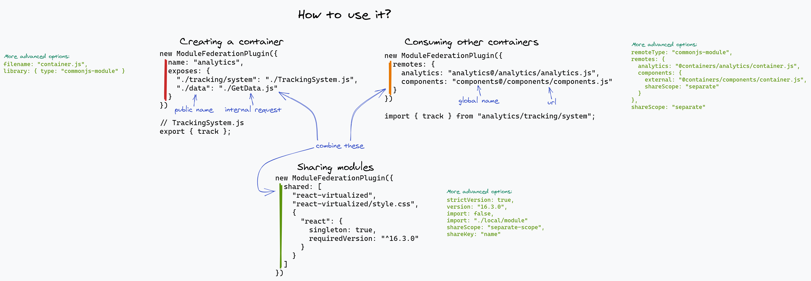](ModuleFederationWebpack5/18.png)

</center>

There is a `ModuleFederationPlugin` to use Module Federation. Different properties are used to set up the different aspects.

To create a container the `exposes` property is the important one. Here all modules are specified that should be accessible for a consumer of the container. One can give them a public name, which is the name that the consumer has to use and point it a module in their own codebase (internal request). Any module is supported, it might be javascript, typescript, CSS, WebAssembly, assets, anything webpack can process in your codebase.

They consume other containers the `remotes` property is the goto property. It's an object with all containers that should be usable in the current build. The key is a module scope at which the containers exposed modules should be accessible in the own codebase. Any request starting with this key will create a remote module that will be loaded at runtime. The value is the location of the container. By default `script` externals are used as container locations. Here one would specify an URL of a script file and a global. This script will be loaded at runtime and the container is accessed from the global.

To share modules on any side the `shared` property should be used. For simple cases, a list of module specifiers can be provided which flag these modules (when used in the codebase) as a shared module. They will be provided in the currently installed version and consumed in a version range specified in the package.json of the consuming package.

All properties also support advanced configuration options. One notable advanced option is the `singleton: true` option for shared modules. It makes sure that only a single instance of the module is created at runtime. This is needed for some libraries like e. g. `react` which dislike being instantiated multiple times in the same application. An invalid version range will only lead to a warning at runtime in this case.

More advanced options allow to override or disable automatically inferred values like `version`, `requiredVersion` or `filename`, allow to use different ways of libraries and externals e. g. for usage in Node.js or opt-into stricter version checking (which lead to errors instead of warnings when version range is invalid).

<hr>
<center>

[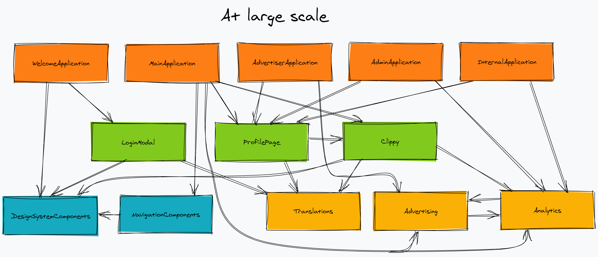](ModuleFederationWebpack5/19.png)

</center>

<hr>
<center>

[](ModuleFederationWebpack5/20.png)

</center>

Now we have built all these separate containers. It's time to put them together. This is were the fun starts...

We will look into two different approaches: Everygreen and Managed.

<hr>
<center>

[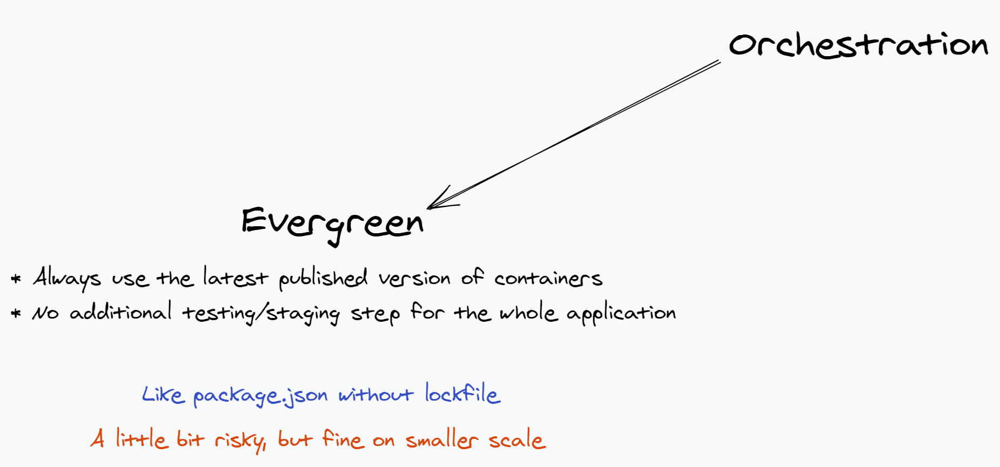](ModuleFederationWebpack5/21.png)

</center>

<hr>
<center>

[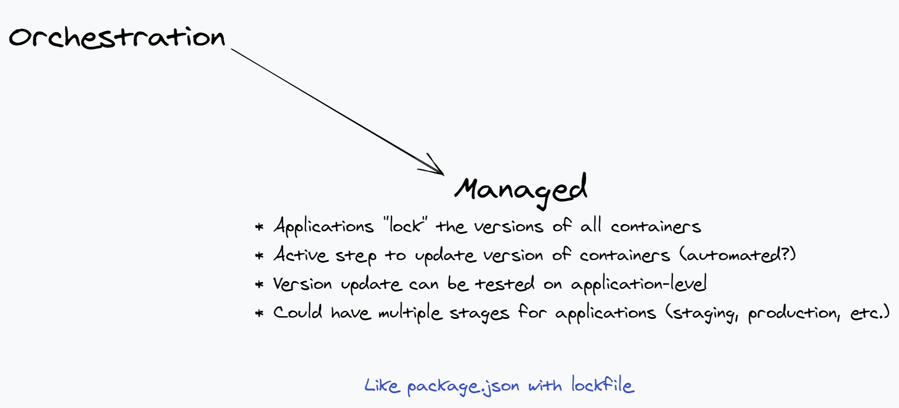](ModuleFederationWebpack5/22.png)

</center>

<hr>
<details><summary>Bonus content: Read more about using the Managed approach for client and server-side</summary>

<center>

[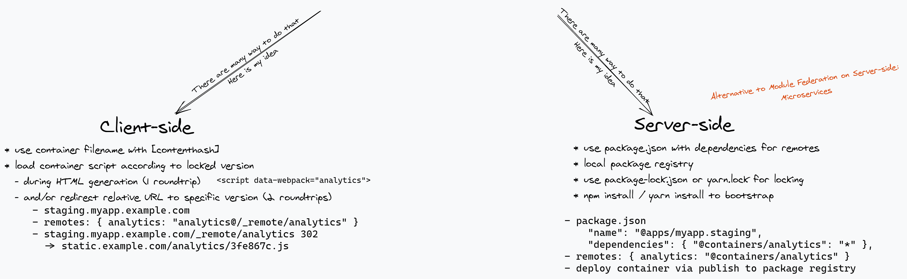](ModuleFederationWebpack5/23.png)

</center>

One way to use the Managed approach on client-side is a clever way to use server-relative URLs together with a simple API that redirects requests based on the locked version.

Each application is placed on a different (sub)domain. Examples: `app.example.com` and `admin.examples`. Additional nesting could be added for multiple stages for an application. Examples: `myapp.example.com` for the production version, `staging.myapp.example.com` for the staging version.

All containers are referenced by a server-relative URL pointing to an API available on all domains: `/_remotes/<name>`. Depending on the application that will resolve to an absolute URL like `https://staging.myapp.example.com/_remotes/analytics`. The API is now able to extract the referencing application and target container from this request. It will lookup the container in the lockfile of the application and redirect the request to the final URL of the container, e. g. `302 Location: https://static.example.com/analytics/3fe867c.js`.

The redirect is a little bit in-perfect as it requires 2 roundtrips to the server to load the container. On the second visit, the container itself is probably cached, but as the redirect can't be cached (to allow changing the lockfile anytime), it will still take 1 roundtrip.

The `/_remotes/` API could directly respond with the container javascript. This would reduce the initial loading to 1 roundtrip, but the second visit case will still use 1 roundtrip as we can't cache the API correctly.

So while keeping the API solution as a fallback we add an additional layer. We generate the HTML with some server logic and inject script tags to the final container URLs directly. Module Federation in webpack is able to pick them up when `data-webpack="<name>"` is set on the script tags. (It's also able to pick up the exposed globals directly, but `data-webpack` is needed when all script tags are async and application script may execute before the container script. In this case, the loading logic will find the `data-webpack` script tag and attach event handlers to it.)

This results in a single roundtrip on the initial page load and 0 roundtrips for the second visit.

Technically it's also possible to inline the container script directly into HTML as they are pretty small (a few kB). This would lead to 0 roundtrips for the initial page load too. But this solution is a bit problematic to scale with many containers as it will blow up the size of the HTML and prevent caching of the containers.

To use the evergreen approach instead always redirect to the latest version of a container.

<hr>

One way to use the Managed approach on server-side it the use npm/yarn package.json for the compiled dist files as well.

For this approach, you need a private package registry where you can push your compiled dist files to.

To deploy a container, create a package out of your webpack output files and a package.json. In this example, we use `@containers/` a prefix for compiled container packages. The analytics container package could look like this:

```json
{
    "name": "@containers/analytics",
    "version": "1.2.3",
    "main": "./container.js"
}
```

In the `ModuleFederationPlugin` containers would be created like this:

```js
new ModuleFederationPlugin({
    name: "analytics",
    library: "commonjs-module",
    exposes: {
        "./something": "./something"
    }
})
```

To create an application that uses the container you would do the same (maybe with a different prefix like `@apps/`) and also specify the container package as a dependency:

```json
{
    "name": "@apps/myapp",
    "version": "3.4.5",
    "dependencies": {
        "@containers/analytics": "*"
    }
}
```

In the `ModuleFederationPlugin` containers would be references like this:

```js
new ModuleFederationPlugin({
    name: "myapp",
    remoteType: "commonjs-module",
    remotes: {
        analytics: "@container/analytics"
    }
})
```

Now you can run `npm install`/`yarn` as part of your server bootstrap.
This will download the containers into `node_modules` from your private registry.
The Module Federation runtime will load them via `require("@container/analytics")`.
All code will come together in the same node.js process.

To use the Managed approach keep a `package-lock.json`/`yarn.lock` file together with your dist package.json.
You could commit this file as part of your application repo.
You could use multiple lockfiles e. g. for staging and production environments.

To update to the latest version of the container usually npm/yarn utilities can be used, or the lockfile could be deleted and regenerated.

To use the evergreen approach instead only keep a package.json and no lockfile. A mixed approach might require some additional tooling.

Note that package.jsons for containers might also have `dependencies` if they reference other containers.

</details>

<hr>
<center>

[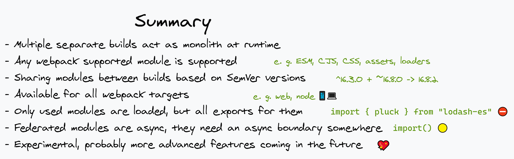](ModuleFederationWebpack5/24.png)

</center>

<hr>
<center>

[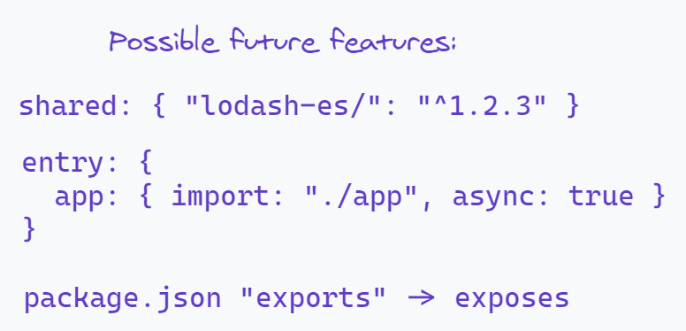](ModuleFederationWebpack5/25.png)

</center>

Support for sharing prefixed module requests (`lodash-es/`) has been adding now.

<hr>
<center>

[](ModuleFederationWebpack5/26.png)

</center>

Documentation:
https://webpack.js.org/concepts/module-federation/

Talk by Manfred Steyer (1h):
https://youtu.be/-ThsrA8hRLc

More videos in a playlist by Zack Jackson:
https://www.youtube.com/playlist?list=PLWSiF9YHHK-DqsFHGYbeAMwbd9xcZbEWJ

webpack core example:
https://github.com/webpack/webpack/tree/master/examples/module-federation

More examples by Zack Jackson:
https://github.com/module-federation/module-federation-examples

github: https://github.com/sokra

twitter: https://twitter.com/wSokra

<hr>
<center>

[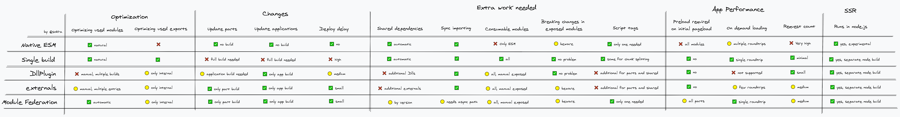](ModuleFederationWebpack5/27.png)

</center>

Bonus content: A large chart comparing all the different approaches shown here.

You see that there is no clear winning approach here. Module Federation is not perfect at all categories, it's more a good trade-off in all categories.

<hr>
<center>

[](ModuleFederationWebpack5/28.png)

</center>

Bonus content: A chart showing the internals of the `ModuleFederationPlugin`.

Each property delegated to a lower level plugin, which technically can also be used on their own. One notable mention is the `SharePlugin` which could also be used to share modules in a different system.
