

[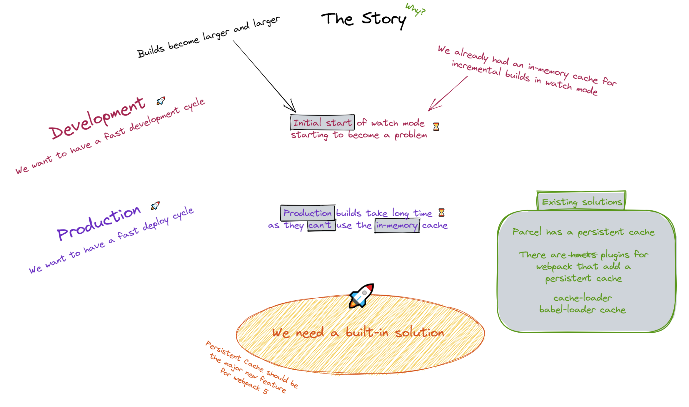](PersistentCachingWebpack5/2.png)

[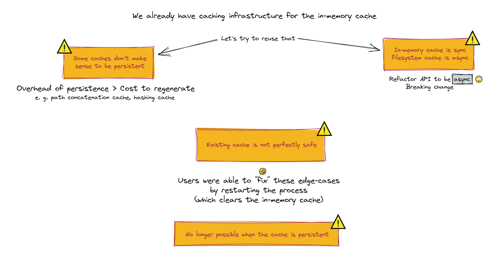](PersistentCachingWebpack5/4.png)

[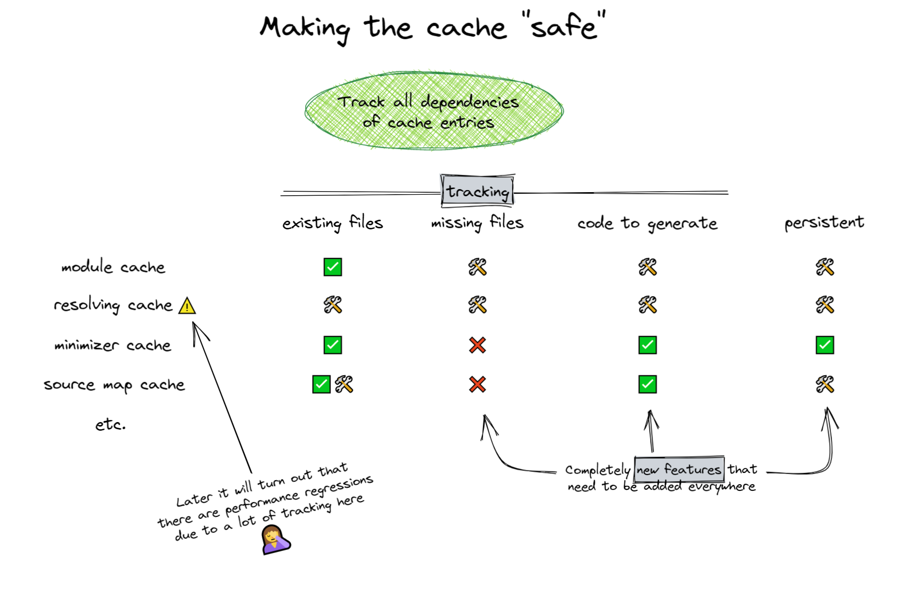](PersistentCachingWebpack5/5.png)

[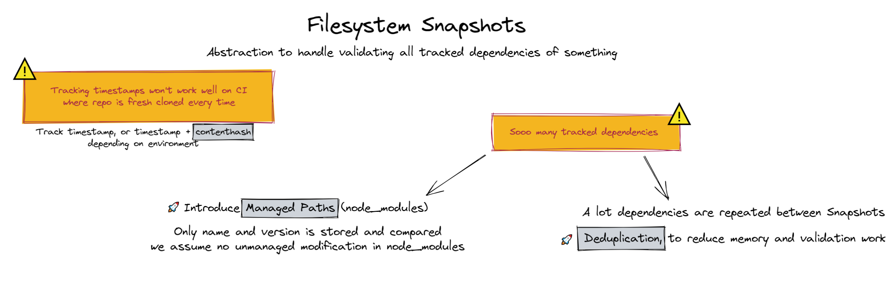](PersistentCachingWebpack5/6.png)

[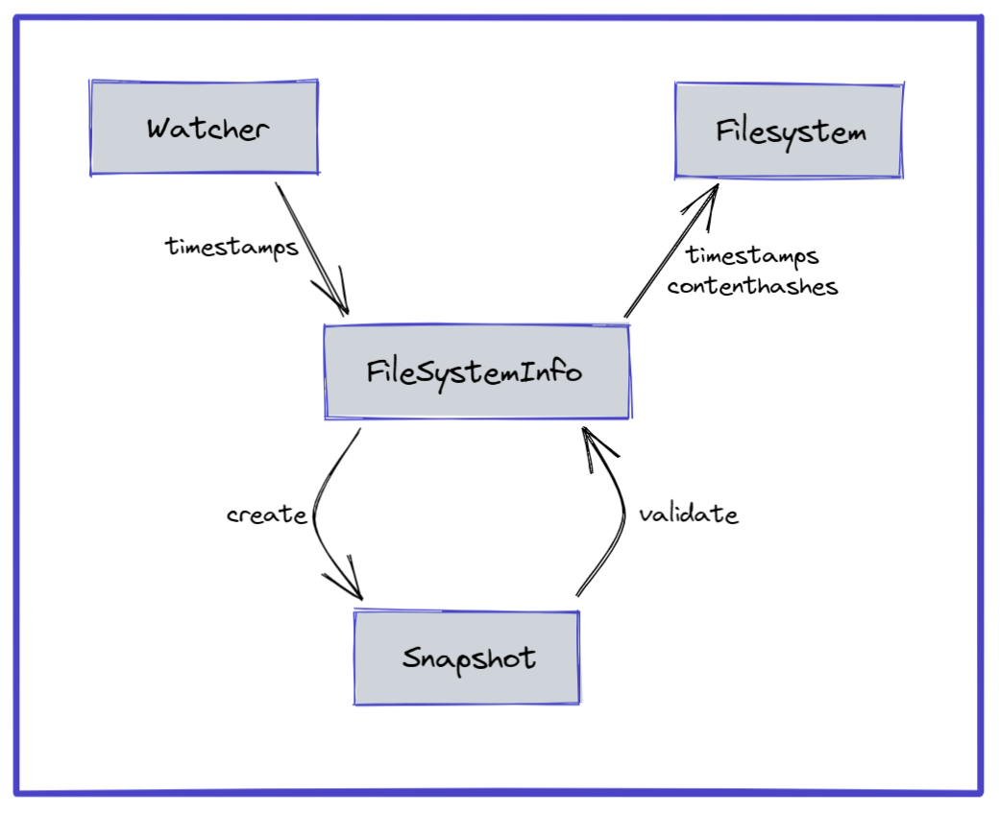](PersistentCachingWebpack5/7.png)

[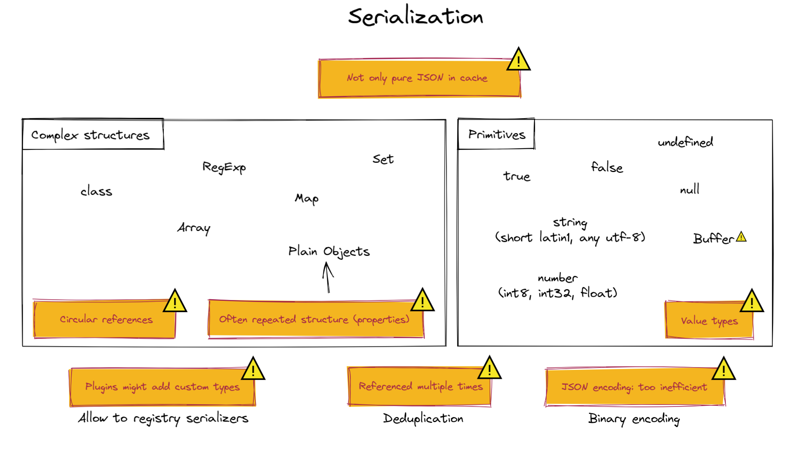](PersistentCachingWebpack5/8.png)

[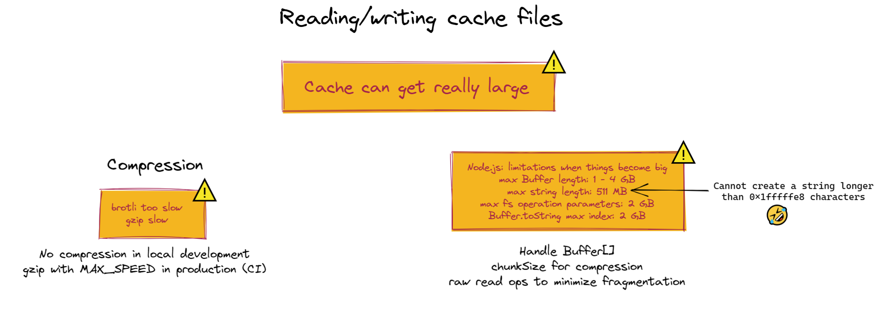](PersistentCachingWebpack5/9.png)

[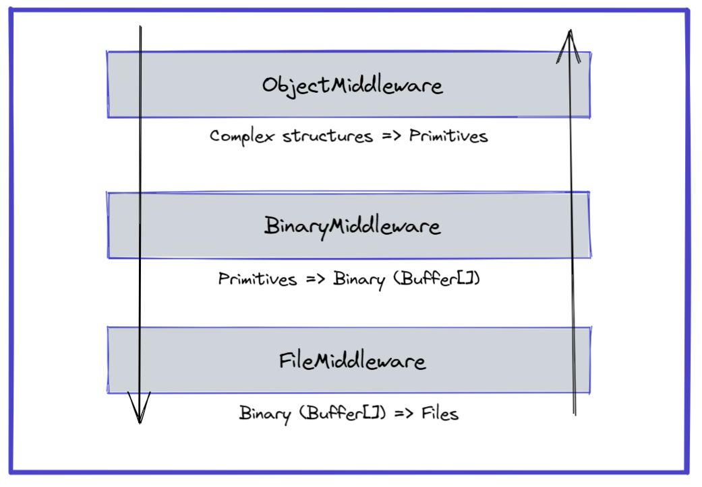](PersistentCachingWebpack5/10.png)

[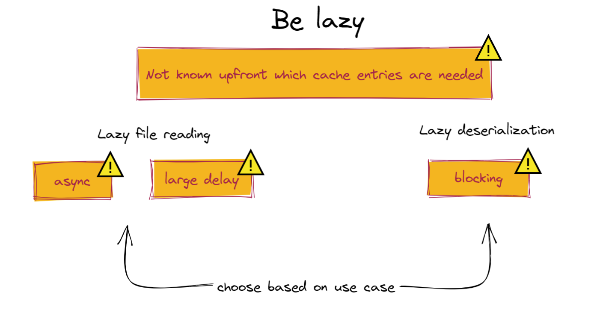](PersistentCachingWebpack5/11.png)

[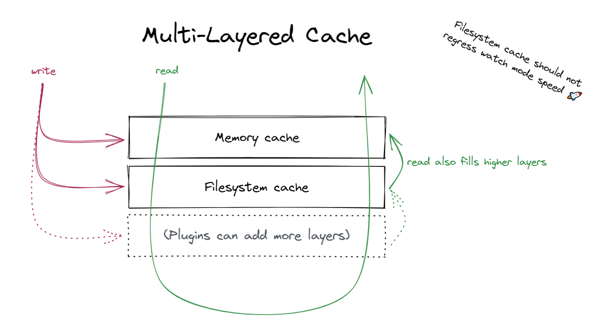](PersistentCachingWebpack5/12.png)

[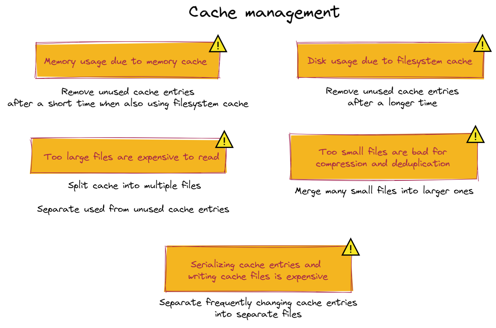](PersistentCachingWebpack5/13.png)

[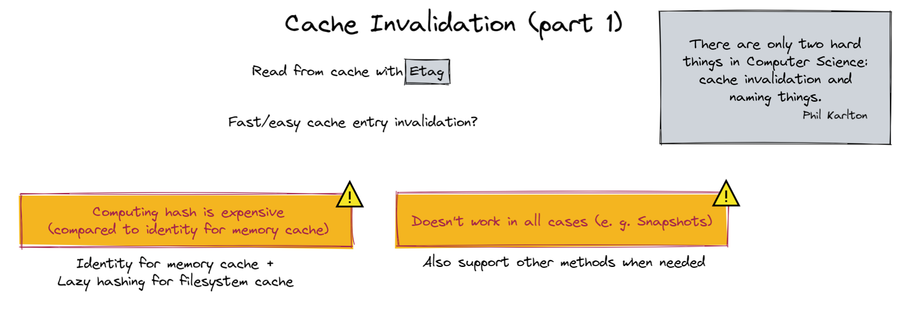](PersistentCachingWebpack5/14.png)

[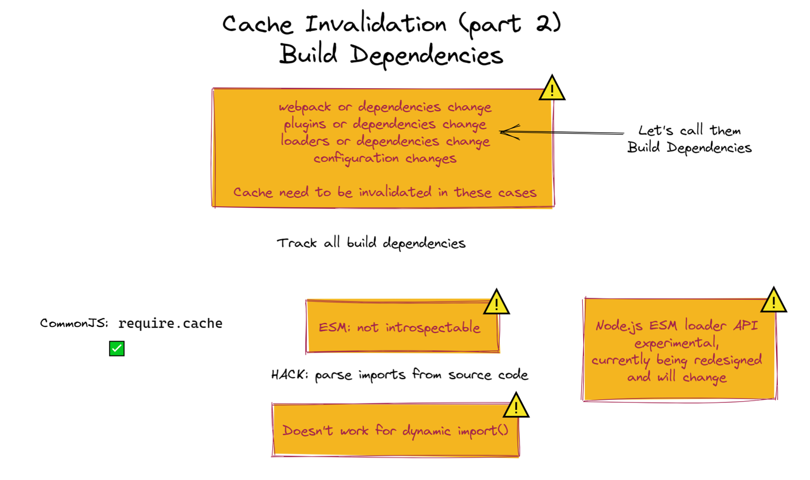](PersistentCachingWebpack5/15.png)

